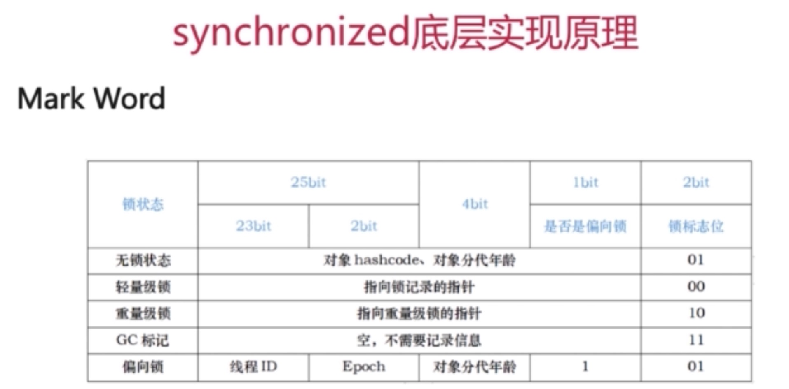

# Java多线程与并发-原理
## 一、synchronized
### 1、线程安全问题的主要诱因
* 存在共享数据（也成为临界资源）
* 存在多条线程共同操作这些共享数据
### 2、解决问题的根本方法：
#### 同一时刻有且只有一个线程在操作共享数据，其他线程必须等到该线程处理完数据后再对共享数据进行操作

### 3、互斥锁的特性
#### （1）、互斥性：即在同一时间只允许一个线程持有某个对象锁，通过这种特性来实现多线程的协调机制，这样在同一时刻只有一个线程对需要同步的代码块（复合操作）进行访问。互斥性也称为操作的原子性。
#### （2）、可见性：必须确保在锁释放之前，对共享变量所做的修改，对于随后获得该锁的另一个线程是可见的（即在获得锁时应获得最新共享变量的值），否则另一个线程可能是在本地缓存的某个副本上继续操作，从而引起不一致
#### （3）、synchronized 锁的不是代码，锁的都是对象

### 4、根据获取的锁的分类 ：获取对象锁和获取类锁
#### （1）、获取对象锁的两种用法
##### ①、同步代码块（synchronized(this), synchronized(类实例对象)）, 锁是小括号()中的实例对象。
##### ②、同步非静态方法（synchronized method），锁时当前对象的实例对象

#### （2）、获取类锁的两种方法
##### ①、同步代码块（synchronized (类,class)），锁时小括号 () 中的类对象( Class对象 )。
##### ②、同步静态方法（synchronized static method）,锁时当前对象的类对象( Class对象)

### 5、对象锁和类锁的总结
#### 1、有线程访问对象的同步代码块时，另外的线程可以访问该对象的非同步代码块；
#### 2、若锁住的是同一个对象，一个线程在访问对象的同步代码块时，另一个访问对象的同步代码块的线程会被阻塞
#### 3、若锁住的是同一个对象，一个线程在访问对象的同步方法时，另一个访问对象同步方法的线程会被阻塞，
#### 4、若锁住的是同一个对象，一个线程在访问对象的同步代码块式，另一个访问对象同步方法的线程会被阻塞，反之亦然。
#### 5、同一个类的不同对象的对象锁互不干扰
#### 6、类锁由于也是一种特殊的对象锁，因此表现和上述1、2、3、4、一致，而由于一个类只有一把对象锁，所以同一个类的不同对象使用类锁，将会是同步的
#### 7、类锁和对象锁互不干扰

## 二、synchronized底层实现原理
### 1、实现synchronized的基础
* Java对象头
* Monitor
### 2、对象在内存中的布局（分为三块区域）
* 对象头
* 实例数据
* 对齐填充

### 3、对象头结构
* Mark Word:是实现轻量级锁和偏向锁的关键

#### （1）、Mark Word 
* 由于对象头信息是与对象自身定义的没有关系的额外存储成本，因此考虑JVM的空间效率，Mark Word 被设计成为非固定的数据结构，
以便存储更多的有效数据，它会根据对象本身的状态，复用自己的存储空间

### 4、Monitor : 每个Java对象天生自带了一把看不见的锁，它叫做内部锁，或者monitor锁，Monitor也称为管程或者监视器锁，可以理解同步工具，也可以描述为一种同步机制

* 重量级锁: 也就是通常说的Synchronized对象锁，锁的标识为是10，指针指向monitor对象的起始地址
* 在Java虚拟机中，monitor是由hospot虚拟机实现的，是由C++编写的 

### 5、Monitor锁的竞争、获取与释放

### 6、什么是重入
###### 从互斥锁的设计上来说，当一个线程试图操作一个由其他线程持有的对象锁的临界资源时，将会处于阻塞状态，但当一个线程再次请求自己持有对象锁的临界资源时，这种情况属于重入

### 7、为什么会对synchronized嗤之以鼻
* 早期版本中，synchronize属于重量级锁，依赖于Mutex Lock实现
* 线程之间的切换需要从用户态到核心态，开销比较大

### 8、Java6之后，synchronize性能得到了很大的提升
* Adaptive Spinning (自适应锁、自旋锁)
* Lock Eliminate (锁消除)
* Lock Coarsening (锁粗化)
* Lightweight Locking (轻量级锁) 
* Biased Locking (偏向锁)

### 9、自旋锁与自适应自旋锁
#### (1)、自旋锁
* 许多情况下，共享数据的锁定状态持续时间较短，切换线程不值得
* 通过让线程执行忙循环等待锁的释放，不让出CPU
* java6默认为开启状态，自选锁本质上与阻塞并不相同，如果锁占用的时间非常的短，那么锁的性能也会非常的好，
相反，如果锁占用的时间非常长，那么也会带来相应的性能开销
* 缺点 ：若锁被其他线程长时间占用，会带来许多性能上的开销，如果锁占用的时间太长，自旋会白白浪费CPU的资源

#### (2)、自适应自旋锁
* 自旋的次数不在固定
* 由前一次在同一个锁上自旋时间及锁的拥有这的状态来决定，
如果一个线程在同一个锁对象上自旋等待刚刚成功获取过锁，并且持有锁的线程正在运行中，JVM会认为该锁自旋获取到锁的可能性很大，会自动增加等待时间，比如增加到50次循环
相反，如果对于某个锁，自旋很少成功获取到锁，那在以后要获取这个锁时，将可能省略掉自旋过程，以避免浪费处理器资源

### 10、锁消除
#### (1)、锁消除是虚拟机另外一种锁的优化，这种优化更加彻底
* Java虚拟机在JIT编译时，对运行上下问进行扫描，去除不可能存在竞争的锁

### 11、锁粗化
#### (1)、另一种极端
###### 例如出现在循环体中的锁，即使没有线程竞争互斥同步锁操作，也会导致不必要的性能操作
* 通过扩大加锁的范围，避免反复加锁和解锁

### 12、synchronize的四种状态
* 无锁、偏向锁、轻量级锁、重量级锁
#### (1)、锁膨胀的方向：无锁 -> 偏向锁 -> 轻量级锁 -> 重量级锁
### 13、偏向锁：减少同一个线程获取锁的代价
* 大多数情况下，锁不存在多线程竞争，总是由同一个线程多次获得
##### 核心思想 
###### 如果一个线程获得了锁，那么锁就进入偏向模式，此时Mark Word的结构也变为偏向锁结构，当线程再次请求锁时，无需再做任何同步操作，即获取锁的过程只需要检查Mark Word的锁标记位位偏向锁以及当前线程id等于Mark Word的TheadID即可，这样就省去了大量有关锁申请的操作
###### 不适用于锁竞争表激烈的多线程场合

### 14、轻量级锁
##### 轻量级锁是由偏向锁升级来的，偏向锁运行在一个线程进入同步块的情况下，当第二个线程加入锁争用的时候，偏向锁就会升级为轻量级锁
##### 适用的场景：线程交替执行同步块
##### 若存在同一时间访问同一锁的情况，就会导致轻量级锁膨胀为重量级锁

### 15、锁的内存语义
##### 当线程释放锁时，Java内存模型会把该线程对应的本地内存中的共享变量刷新到主内存中；
##### 而当线程获取锁时，Java内存模型会把该线程对应的本地内存置为无效，从而是得被监视器保护的临界区代码必须从主内存中读取共享变量

### 16、偏向锁、轻量级锁、重量级锁的汇总

## 三、synchronized和ReentrantLock的区别
### 1、ReentrantLock(重入锁、再入锁)
###### 在Java5以前，synchronize是仅有的同步手段，从Java5之后就引入了ReentrantLock再入锁的实现
* 位于java.util.concurrent.locks包 (J.U.C)
* 和CountDownLatch、FutureTask、Semaphore一样基于AQS实现
* 能够实现比synchronized更细粒度的控制，如控制fairness
* 调用lock()之后，必须调用unlock()释放锁
* 性能未必比synchronized高，而且也是可重入的

### 2、ReentrantLock公平性的设置
* ReentrantLock fairLock = new ReentrantLock(true);  -- 公平锁
* 参数为true时，倾向于将锁赋予等待时间最久的线程
###### 公平性是减少线程饥饿的常用方法，所谓的线程饥饿就是线程长时间等待锁，始终无法获取锁的情况
* 公平锁：获取锁的顺序按先后调用lock方法的顺序(慎用)
* 非公平锁：抢占的顺序不一定，看运气
* synchronized是非公平锁

### 3、ReentrantLock将锁对象化
* 判断是否有线程，或者某个特定线程，在排队等待获取锁
* 待超时的获取锁的尝试
* 感知到有没有成功获取锁

### 4、是否能将wait\notify\notifyAll对象化，即能否将复杂晦涩的同步操作转变为直观可控的对象行为
* java.util.concurrent.locks.Condition 可以方便实现他们三个方法已有的功能，转变为对象行为

### 5、总结
* synchronize是关键字，ReentrantLock是类
* ReentrantLock可以对获取锁的等待时间进行设置，避免死锁
* ReentrantLock可以获取各种锁的信息
* ReentrantLock可以灵活的实现多路通知
* 机制：synchronize操作的是对象头中的Mark Word，ReentrantLock调用Unsafe类的pack()方法来加锁

## 四、jmm的内存可见性
### 1、什么是Java内存模型中的happens-before
#### (1)、Java内存模型JMM
###### Java内存模型(即Java Memory Model，简称JMM)，本身是一种抽象的概念，并不是真实存在，他描述的是一组规则或规范，通过这组规范定义了程序中各个变量(包括实例字段，静态字段和构成数组对象的元素)的访问形式

### 2、JMM中的主内存和工作内存
#### (1)、JMM中的主内存
* 存储Java实例对象
* 包括成员变量、类类型、常量、静态变量等
* 属于数据共享的区域，多线程并发操作时会引发线程安全问题

#### (2)、JMM的工作内存
* 存储当前方法的所有本地变量，本地变量对其他线程不可见
* 字节码行号指示器，Native方法信息
* 属于线程私有数据区域，不存在线程安全问题

#### (3)、JMM与Java内存区域划分是不同的概念层次
* JMM描述的是一组规则，围绕原子性、有序性、可见性展开
* 相似点：存在共享区域和私有区域
###### 在JMM中主内存属于共享数据区域，从某个程度上讲，应该包括了堆，和方法区，工作内存线程私有区域，从某种程度上讲，包含了程序计数器，虚拟机栈，以及本地方法栈

#### (4)、主内存和工作内存的数据存储类型以及操作方式归纳
* 方法里的基本数据类型本地变量将直接存储在工作内存的栈帧结构中
* 引用类型的本地变量：引用存储在工作内存的栈帧中，对象实例存储在主内存中(堆)
* 成员变量、static变量、类信息均会被存储在主内存中
* 主内存共享的方式是线程各拷贝一份数据到工作内存中，操作完成后刷新回主内存中

### 3、JMM如何解决可见性问题

#### (1)、指令重排序需要满足的条件
* 在单线程环境下不能改变程序运行的结果
* 若存在数据依赖关系，不允许重排序
##### 无法通过happens-before原则推导出来的，才能进行指令的重排序

#### (2)、A操作的结果需要对B操作可见，则A与B存在happens-before关系

    i = 1; // 线程A执行
    j = i; // 线程B执行

### 4、happens-before的概念
##### 如果俩个操作不满足上述任意一个happens-before规则，那么这俩个操作就没有顺序的保障，JVM可以对这俩个操作进行重排序
##### 如果A happens-before操作B，那么操作A在内存上所做的操作对操作B都是可见的

### 5、volatile：JVM提供的轻量级同步机制
* 保证被volatile修饰的共享变量对所有线程总是可见的
* 禁止指令的重排序

### 6、volatile的可见性 (存在线程安全问题)

    public class VolatileVisivility {
        public static volatile int value = 0;
        public staitc void increase(){
            value ++;
        }
    }
   
##### 对于上述方法 increase() 必须使用synchronize关键字修饰才能保证线程安全
#### 补充：synchronize关键字解决的是执行控制的问题，它会阻止其他线程获取当前对象的监控锁(monitor锁)，这样就使得当前对象中被synchronize保护的代码块无发被其他线程访问，也就无法并发执行

    public class VolatileVisivility {
        public static int value = 0;
        public synchronize staitc void increase(){
            value ++;
        }
    }
##### 更重要的是synchronize还会创建一个内存屏障，内存屏障指令保证了所有CPU结果都会直接刷到主存中，从而保证了操作的可见性，同时也使得先获得这个锁的线程的所有操作都happens-before于随后获得这个锁的线程的操作，一旦使用synchronize修饰方法之后，由于synchronize本身也具备于volatile相同的特性，即可见性，因此在这样的情况下就可以完全省去volatile去修饰变量

    public class VolatileSafe{
        // 由于boolean变量的修改是原子操作，所以对boolean变量的修改对其他线程是立即可见的，所以也是线程安全的
        volatile boolean shutdown;
        
        public void close(){
            shutdown = true;
        }
        
        public void doWork(){
            while(!shutdown){
                System.out.println("safe...");
            }
        }
    }

###### 由于boolean变量的修改是原子操作，所以对boolean变量的修改对其他线程是立即可见的，所以也是线程安全的

### 7、volatile变量为何立即可见？
##### 当写一个volatile变量时，JMM会把该线程对应的工作内存中的共享变量值刷新到主内存中；
##### 当读取一个volatile变量时，JMM会把该线程对应的工作内存置为无效，需要重新去主内存中重新读取共享变量

### 8、volatile如何禁止指令重排序优化

#### 内存屏障(Memory Barrier，是一个内存指令)
##### 1、保证特定操作的执行顺序
##### 2、保证某些变量的内存可见性
###### 通过插入内存屏障指令禁止在内存屏障前后的指令执行重排序优化
###### 强制刷出各种CPU的缓存数据，因此任何CPU上的线程都能读取到这些数据的最新版本

### 9、volatile和synchronized的区别
* 1:volatile本质是在告诉JVM当前变量在寄存器(工作内存)中的值是不确定的，需要从主内存中读取；
synchronized则是锁定当前变量，只有当前线程可以访问该变量，其他线程被阻塞住直到该线程完成变量操作为止
* 2：volatile仅能使用在变量级别；synchronized则可以使用在变量、方法、和类级别；
* 3：volatile仅能是吸纳变量的修改可见性，不能保证原则性；而synchronized则可以保证变量修改的可见性和原子性
* 4：volatile不会造成线程的阻塞；synchronize可能造成线程的阻塞
* 5：volatile标记的变量不会被编译器优化；synchronized标记的变量可以被编译器优化

## 五、CAS(Compare and Swap)
###### 像synchronize这种独占锁属于悲观锁，悲观锁始终假定会发生并发冲突，因此会屏蔽一切可能会违反数据完整性的操作
###### 除此之外还有乐观锁，它假设不会发生并发冲突，因此只在提交操作是检查是否违反数据完整性，如果提交失败则会进行重试，乐观锁常见的就是CAS

### 1、一种高效实现线程安全性的方法
* 支持原子更新操作，适用于计数器，序列发生器等场景
* 属于乐观锁机制，号称lock-free
* CAS操作失败时有开发者决定是继续尝试，还是执行别的操作
### 2、CAS思想
* 包含三个操作数 ---- 内存位置(V)、预期原值(A)和新值(B)
###### 执行CAS操作的时候，将内存位置的值(即主内存位置的值)于预期原值进行比较，如果相匹配，那么处理器会自动将该位置的值更新为新值，否则处理器不做任何操作
###### 例如：当一个线程需要修改共享变量的值，完成这个操作，先取出共享变量的值A，基于A的基础进行计算，得到新值B，执行完毕之后需要更新共享变量的时候，我们需要调用CAS方法去更新共享变量的值

### 3、CAS多数情况下对开发者来说是透明的
* J.U.C的atomic包提供了常用的原子性数据类型以及引用、数组等相关原子类型和更新操作工具，是很多线程安全的首选
* Unsafe类虽然提供CAS服务，但因能够操作任意内存地址地址读写而有隐患
* Java9以后，可以使用Variable Handle API来代替Unsafe

### 4、缺点
* 若循环时间长，则开销很大
* 只能保证一个共享变量的原子操作
* ABA问题
###### 为了解决ABA问题，J.U.C提供了带有标记的原子引用类 -- AtomicStampedReference，可以通过控制变量值的版本来保证CAS的正确性

## 六、Java线程池
###### 在Web开发中服务器需要接受请求并且处理请求，所以会为一个请求来分配一个线程来处理，如果并发的请求非常多，但每个线程执行的时间很多，这样就会频繁的创建和销毁线程，这样就会大大降低服务器的效率

### 1、利用Executors创建不同的线程池满足不同场景的需求

#### (1)、newFixedThreadPool(int nThreads)
###### 指定工作线程数量的线程数
#### (2)、newCachedThreadPool()
###### 处理大量短时间工作任务的线程池
    1)、视图缓存线程并重用，当我缓存线程可用时，就会创建新的工作线程；
    2)、如果线程闲置的时间超过了阈值，则会被终止并移除缓存；
    3)、系统长时间闲置的时候，不会消耗什么资源
    
#### (3)、newSingleThreadExecutor()
###### 创建唯一的工作线程来执行任务，如果线程异常结束，会有另一个线程取代它
#### (4)、newSingleThreadScheduledExecution()与newScheduleThreadPool(int corePoolSize)
###### 定时或者周期性的工作调度，两者的区别在于单一工作线程还是多个线程
#### (5)、newWordStealingPool()
###### 内部会构架ForkJoinPool，利用wording-stealing算法，并行地处理任务，不保证处理顺序

### 2、Fork/Join框架
###### Java7提供的一个用于并行执行任务的框架，
* 把大人物分割成若干个小人物并行执行，最终汇总每个小任务结束后得到大人物结果的框架
* Work-Stealing算法：某个线程从其他队列里窃取任务来执行

### 3、为什么要使用线程池
* 降低资源消耗，即通过重复利用已创建的线程，来降低线程创建和消耗造成的消耗
* 提高线程的可管理性

### 4、Executor的框架
###### Executor框架是根据一组执行策略来调用，调度、执行、和控制的异步任务的框架，目的是提供一种将任务提交与任务如何运行的分离开来的机制

### 5、J.U.C的三个Executor接口
* Executor : 运行新任务的简单接口，将任务提交和任务执行细节解耦

    Thread t = new Thread();
    t.start();
    
    Thread t = new Thread();
    executor.execute(t);
    
* ExecutorService : 具备管理执行器和任务生命周期的方法，提交任务机制更完善(如返回 Future 而不是 void)

* ScheduledExecutorService : 支持Future和定期执行任务

### 6、ThreadPoolExecutor (线程池的核心实现类)

### 7、ThreadPoolExecutor的构造函数
* corePoolSize:核心线程数量
* maximumPoolSize:线程不够用时能够创建的最大线程数
* workQueue:任务等待队列
* keepAliveTime:线程池维护的线程所允许的空闲时间，抢占的顺序不一定，看运气
* threadFactory:用来创建新线程，默认使用Executors.defaultThreadFactory来创建线程，使用默认的这个来创建线程池会使新创建的线程具有相同的Priority(优先级)，并且是非守护线程
* handler:线程池的饱和策略

### 8、RejectedExecutionHandler handler : 线程池的饱和策略
* AbortPolicy : 直接抛出异常，这是默认策略
* CallerRunsPolicy : 用调用者所在的线程来执行任务
* DiscardOldestPolicy : 丢弃队列中靠最前的任务，并执行当前任务
* DiscardPolicy : 直接丢弃任务
* 实现RejectedExecutionHandler接口的自定义handler

### 9、新任务提交execute执行后的判断
* 如果运行的线程少于 corePoolSize，则创建新线程来处理任务，即使线程池中的其他线程是空闲的；
* 如果线程池中的线程数量大于等于 corePoolSize 且小于 maximumPoolSize，则只有当workQueue满是才创建新的线程去处理任务；
* 如果设置的 corePoolSize 和 maximumPoolSize 相同，则创建的线程池的大小是固定的，这是需要有新任务提交，
若workQueue未满，则将请求放入到 workQueue中，等待有空闲的线程去从 workQueue中取任务并处理；
* 如果运行的线程数量大于等于 maximumPoolSize，这是如果 workQueue已经满了， 则通过handler所指定的策略来处理任务 

### 10、线程池的状态
* Running : 能接受新提交的任务，并且也能处理阻塞队列中的任务
* Shutdown : 不在接受新提交的任务，但可以处理存量任务
* Stop : 不在接受新提交的任务，也不处理存量任务
* Tidying : 所有的任务都已终止
* Terminated : terminated()方法执行完后进入该状态

### 11、状态转换图

### 12、工作线程的生命周期

### 13、线程池的大小如何选定
* 如果任务为CPU密集型 : 线程数 = 按照核数或者核数 +1 设定
* 如果任务为IO密集型 : 线程数=CPU核数 * (1 + 平均等待时间/平均工作时间)

