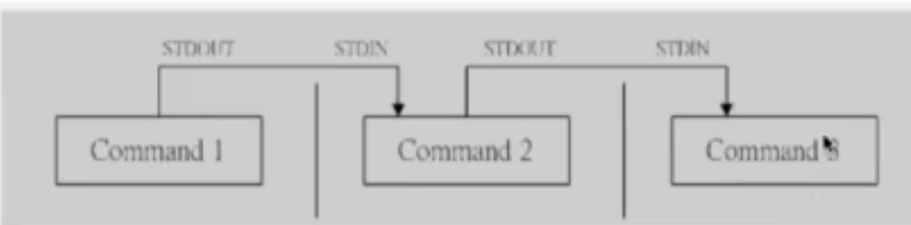

# Linux知识考点
## 一、Linux的体系结构
### 1、Linux
* 体系结构主要分为用户台（用户上层活动）和内核态
* 内核：本质是一段管理计算机硬件设备的程序
* 系统调用：内核的访问接口，是一种不能在简化的操作
* 公用函数库：系统调用的组合拳
* Shell：命令解释器，可编程

### 2、Shell
* ls 
* cat   查看文件
* more  查看文件，逐页阅读，只能向后看
* less  查看文件，逐页阅读，可以前后看
* vim  文件编辑器

## 二、查找特定文件
### find
###### 语法 find path [options] params 
* 作用：在指定目录下查找文件

### 面试里常用的方式
* find / -name "target3.java"   :   精确查找文件
* find / -name "target*"        :   模糊查找文件 
* find / -iname "target*"       :   不区分文件名大小写去查看文件
* man find : 更多关于find指令的使用说明

## 三、检索文件内容
### grep 
###### 语法 ： grep [options] pattern file 
* 全称：Global Regular Expression Print 
* 作用：查找文件里符合条件的字符串，可以使用正则表达式

#### 常用方式
*  grep "moo" target*       "moo" ：要查找的内容， target* ：正则匹配的文件

### 管道操作符 | 
* 可将指令连接起来，前一个指令的输出作为后一个指令的输入

#### 使用管道注意的要点
* 只处理前一个命令正确输出，不处理错误输出
* 右边命令必须能够接受标准输入流，否则传递过程中数据会被抛弃
* 常用来作为接受数据管道的命令有 sed, awk, grep, cut, head, top, less, more, wc, join, sort, split等

    
    grep "PageNotFound" stdout.log.2020-02-19.log | grep -o "java : [0-9]*"  
    -o 可以将前别的输出 当做后边的输入

### 面试里常用的方式
* grep 'partial\[true\]' bsc-plat-al-data.info.log
###### 在内容里边查找包含某个字段的文件，并将相关行展示出来
* grep -o 'engine\[[0-9a-z]*\]'
###### 通过选择 -o选项，筛选出相关符合正则表达式的内容
* grep -v "grep"
###### 过滤掉包含相关字符串的内容

## 四、对文件内容做统计
### awk
###### 语法：awk [options] 'cmd' file 
* 一次读取一行文本，按输入分隔符进行切片，切成多个组成部分
* 将切片直接保存在内建的变量中，$1, $2...($0表示行的全部)
* 支持对单个切片的判断，支持循环判断，默认分隔符为空格

#### 面试里常用的方式
* awk '{print $1, $4}' netstat.txt                      筛选出文件中某些列的数据
* awk '$1=="tcp" && $2==1 {print $0}' netstat.txt       根据一定的条件去筛选文件内容里的某些列的数据
* awk '{enginearr[$1]++}END{for(i in enginnearr)print i "\t" enginearr[i]}' 是对内容进行逐行统计，并列出统计结果
* awk 默认的分隔符是 空格， 可以使用 -F 改变默认分隔符

## 五、批量替换文件内容
### sed
###### 语法：sed [option] 'sed command' filename 
* 全名stream editor，流编辑器
* 适合用于对文本的行内容进行处理

#### 面试里常用的方式
* sed -i 's/^Str/String/' replace.java  修改以Str开始的行 为String
* sed -i 's/\.$/\;\' replace.java  筛选出 . 结尾的行，并且将它们改成 ;
* sed -i 's/Jack/me/g' replace.java
