# 数据库

## 一、关系型数据库主要考点
考点思维导图

### 1、数据库架构
#### （1）、一个面试题引发的【血案】
* 如何设计一个关系型数据库

##### 开始设计
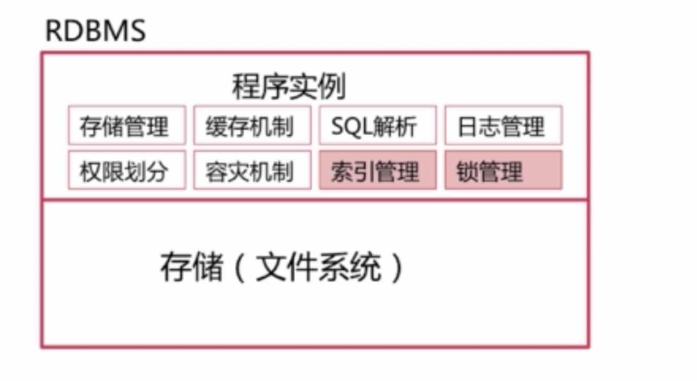

### 2、索引模块 （一）
#### （1）、为什么要使用索引
* 快速查询数据
#### （2）、什么样的信息能成为索引
* 主键、唯一键以及普通键等
#### （3）、索引的数据结构
* 生成索引，建立二叉查找数进行二分查找
* 生成索引，建立B -Tree结构进行查找
* 生成索引，建立B+ -Tree结构进行查找 （Mysql不支持）
* 生成索引，建立Hash结构进行查找

#### （4）、运用二叉查找树实现的索引
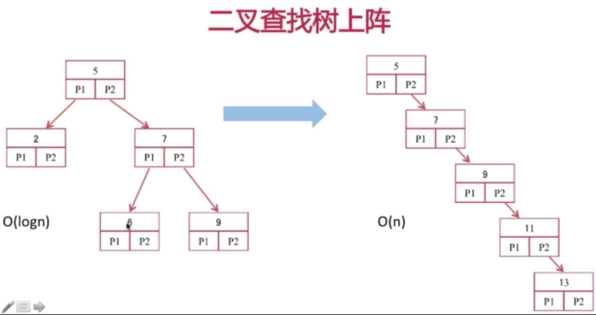

#### （5）、B - Tree
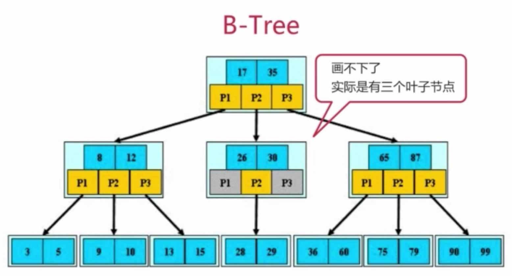

##### 定义
* 根节点至少包括两个孩子
* 树中每个节点最多含有m个孩子（m >= 2）
* 除根节点和叶节点外，其他每个节点至少有ceil(m/2)个孩子       （取上限）
* 所哟叶子节点都位于同一层

#### （6）、B+ - Tree
##### B+树是B树的变体，其定义基本与B树相同，除了
* 非叶子节点的子树指针与关键字个数相同
* 非叶子节点的子树指针P[i], 指向关键字指针 [ K[i], K[i+1] )的子树  （左闭右开）
* 非叶子节点仅用来索引，数据都保存在叶子节点中
* 所有叶子节点均有一个链指针指向下一个叶子节点
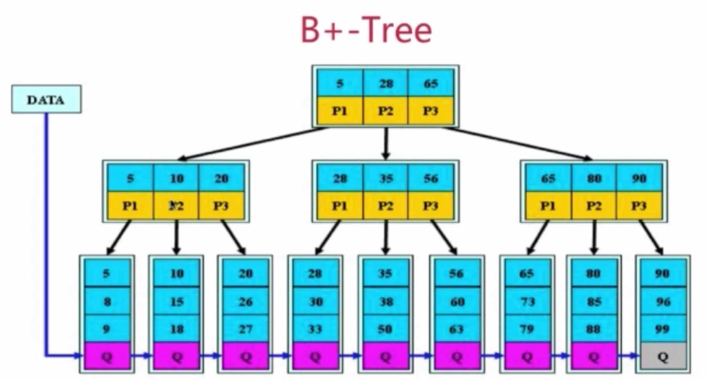

#### （7）、结论
##### B+Tree更适合用来做存储索引
* B+树的磁盘读写代价更低
* B+树的查询效率更加稳定
* B+树更有利于对数据库的扫描

#### （8）、Hash索引
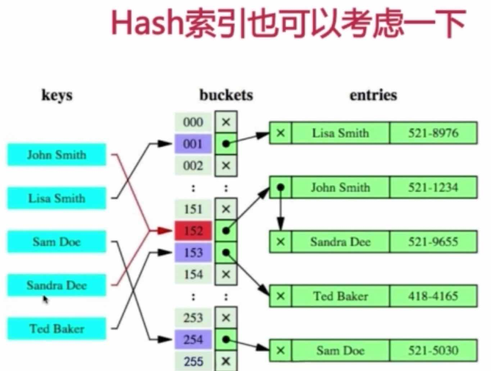
##### 缺点
* 仅仅能满足 "=" , "IN"，不能使用范围查询
* 无法被用来避免数据的排序操作
* 不能利用部分索引键查询
* 不能避免表扫描
* 遇到大量Hash值相等的情况后性能并不一定就会比B-Tree索引高

#### （9）、BitMap索引是个神器
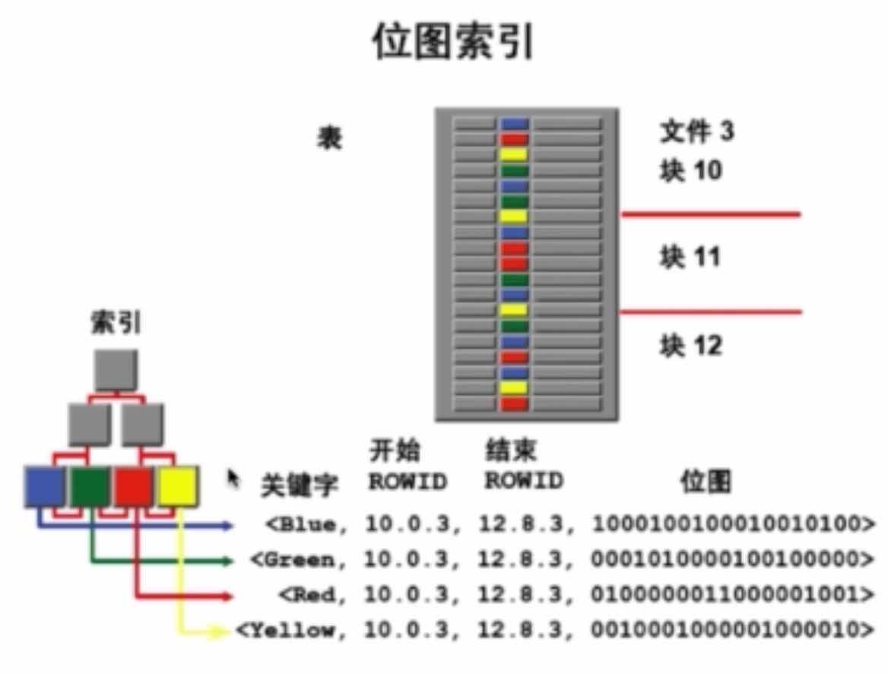

#### （10）、密集索引和稀疏索引的区别
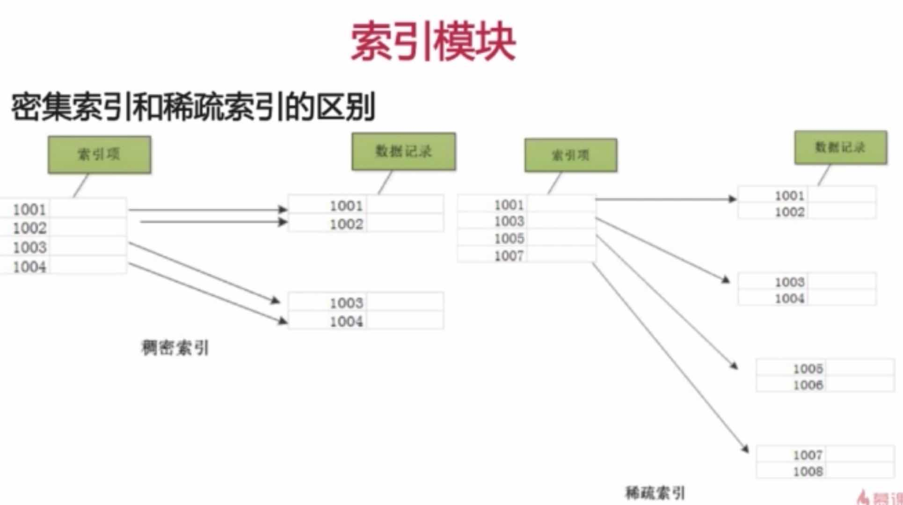
* 密集索引文件中的每个搜索码值都对应一个索引值，
可以理解为：叶子节点保存的不仅仅是键值，还保存了位于同一行记录里的其他列的信息
由于密集决定了表的物理排列顺序，一个表只能有一个物理排列顺序，所以一个表只能创建一个密集索引
* 稀疏索引文件只为索引码的某些值建立索引项， 可以理解为：叶子节点只保存了键位信息，以及该行数据的地址，
有的稀疏索引是仅保存了键位信息和主键

##### 对于Mysql，主要有俩种存储引擎，MyISAM 和 Innodb
* 对于MyISAM，不管是主键索引、唯一键索引、其他索引，其索引均属于稀疏索引
* 而Innodb它必须有且仅有一个密集索引

##### Innodb
* 若一个主键被定义，该主键则为密集索引
* 若没有主键被定义，该表的第一个唯一非空索引则作为密集索引
* 若不满足以上条件，Innodb内部会生成一个隐藏主键（密集索引）
* 非主键索引存储相关键位和其他对应的主键值，包含俩次查找

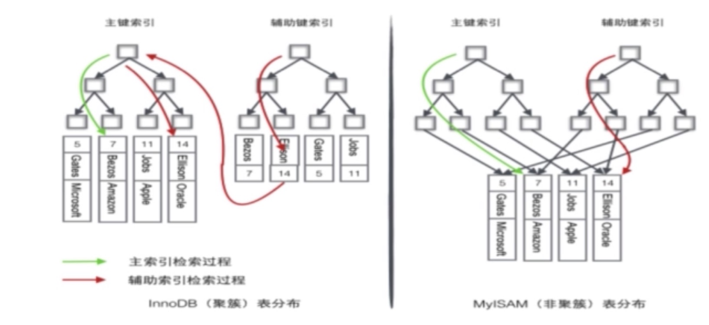

### 3、索引模块 （二）
##### 衍生出来的问题，以mysql为例
* 如何定位并优化慢查询SQL
* 联合索引的最左匹配原则的成因
* 索引是建立的越多越好嘛？

#### （1）、如何定位并优化慢查询SQL
##### 根据慢日志定位慢查询SQL
* show variables like '%query%'  命令可以查询出一些相关的变量 只需要关注三个

        long_query_time             	10.000000
        slow_query_log	                OFF
        slow_query_log_file	            C:\ProgramData\MySQL\MySQL Server 5.5\Data\36X20UW58NRU54I-slow.log
    
* show status like '%slow_queries%' 查询出慢查询的sql数量，之的是本次会话的慢SQL条数
        Slow_queries	                0
    
* set global slow_query_log = on  ：打开慢查询日志
    
* set global long_query_time = 1  ：设置慢查询时间为1秒
    
* 以上属性可以在数据库的 my.ini 配置文件中设置，这样就是永久设置，
    
##### 使用explain等工具分析sql
* id ：sql的执行顺序，越大的越先执行
* type ：system>const>eq_ref>ref>fulltext>ref_or_null>
                      index_merge>unique_subquery>index_subquery>range>index>all
* extra ：
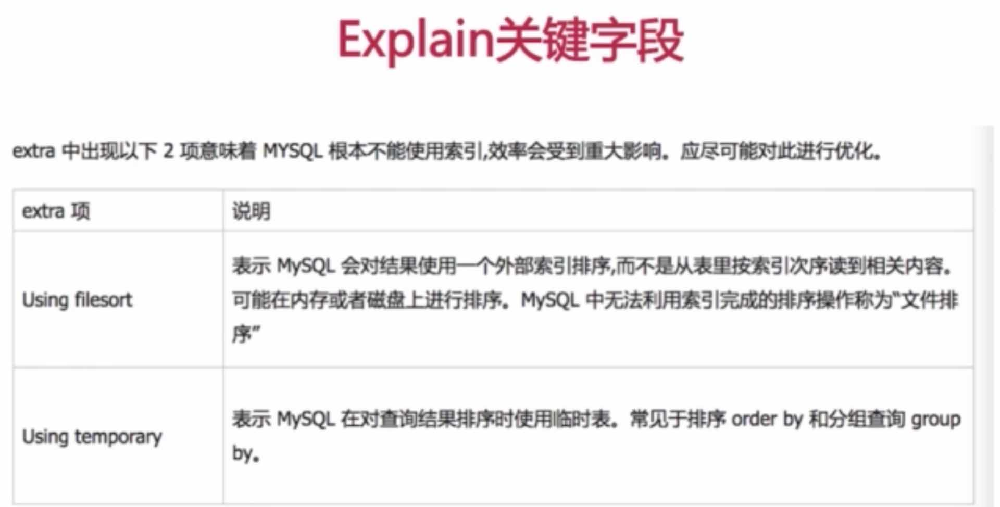
##### 修改sql或者尽量让sql走索引

    explain select count(id) from xxx force index (primary) 这个force index代表强制走哪个索引

#### （2）、联合索引的最左匹配原则的成因
##### 最左匹配原则的定义
* 1、最左前缀匹配原则，非常重要的原则，mysql会一直向右匹配直到遇到范围查询（>、<、between、like）就停止匹配，
    比如 a = 3 and b = 2 and c > 5 and d = 6，如果建立（a,b,c,d）顺序的索引，d是用不到索引的，
    如果建立（a,b,d,c）的索引则都可以用到，a,b,d的顺序可以任意调整
* 2、=和in可以乱序，比如a = 1 and b = 2 and c = 3 建立（a,b,c）索引可以任意顺序，mysql的查询优化器会帮你优化成索引可以识别的形式

##### 成因 （大致描述出了最左匹配原则的规律）
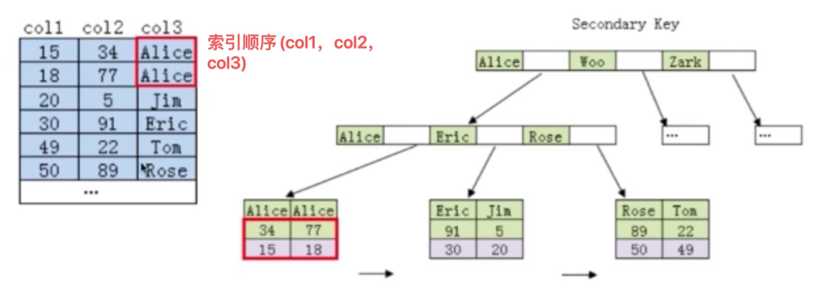

#### （3）、索引是建立的越多越好嘛？
* 数据量小的表不需要建立索引，建立会增加额外的索引开销
* 数据变更需要维护索引，因此更多的索引就意味着更多的维护成本
* 更多的索引意味着也需要更多的空间

### 4、锁模块
##### 常见问题
* MyISAM与Innodb关于锁方面的区别是什么
* 数据库事务的四大特征
* 事务隔离级别以及各级别下的并发访问问题
* Innodb可重复读取隔离级别别下如何避免幻读
* RC、RR级别下的Innodb的非阻塞读如何实现

#### （1）、MyISAM与Innodb关于锁方面的区别是什么
##### MyISAM默认用的是表级锁，不支持行级锁
###### 当表进行查询的时候，MyISAM会自动给表上一个表锁，它会锁住这张表，并且会Block住其他的Session对其去进行数据的更新
* 对于MyISAM当对数据进行Select的时候，它会自动帮我们加上一个表级的读锁，
而对数据进行增删改的时候，它会为我们操作表添加上一个表级的写锁，
当读锁为被释放的时候，另外一个Session想为同一个表加上写锁，那么这个Session就会被阻塞，直到所有的读锁都释放完毕之后

    
    强制给当前表添加read 或 write 锁
    lock tables xxx read;       
    lock tables xxx write;
    unlock tables；
    
* 读锁也叫做共享锁，就是当一个Session对一个表上了读锁，其他Session还是可以对这个表进行读操作的，但是不可以进行写操作了
* 写锁也叫做排他锁，就是当一个Session对一个表上了写锁，其他Session既不可以对这个表进行读操作，也不可以对这个表进行写操作
* 当然也可以手动的为Select语句设置 排他锁 ： select * from xxx where xxx.x ... FOR UPDATE;

##### Innodb默认用的是行级锁，也支持表级锁 ，支持事务
###### Innodb中默认使用的是二段锁，就是加锁和解锁是分为俩个步骤的，即先对同一个事务里的一批操作分别进行加锁，然后到commit的时候，在对事务里加上的锁进行统一的解锁，事务默认的commit是自动提交的

    show variables like 'autocommit'; // 查看事务的默认提交状态
    set autocommit = 0; // 关闭自动提交（只针对当前的session，其他session还是自动提交的）
    commit;  // 通过commit来释放锁
    
    如果不想修改Session的自动提交状态可以通过
    begin transaction; // 开始事务
    
    select * from xxx where xx... LOCK IN SHARE MODE; // 设置共享读锁
    
* 表级锁和索引无关，行级锁和索引（除了用ID主键以外的所有键）有关
* 当不走索引的时候，整张表就会被锁住，也就是此时的查询用的是表级锁，所以Innodb在SQL没有用到所有的时候用的表级锁，
如果SQL用到索引的话用的就是行级锁或者GET锁（涉及都走普通非唯一索引的时候用到的），
* Innodb除了支持这些行级锁，还支持表级的意向锁，意向锁分为共享读锁（IS）、排他写锁（IX），
根MyISAM的表锁差不多，为的是进行表级别的操作不用去轮询每一行看看有没有设行级锁
    
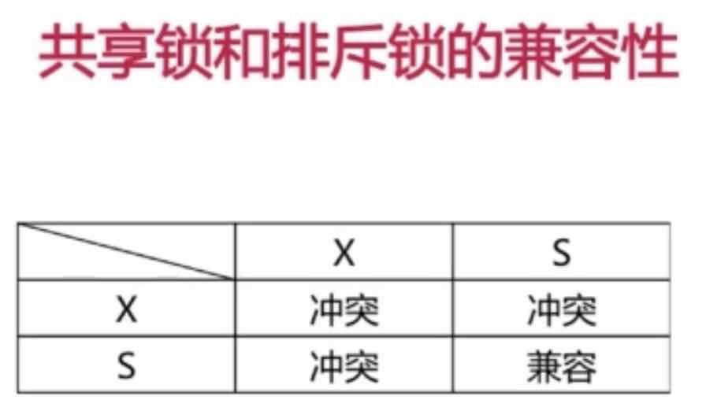
    
##### 关于锁方面的区别
* 锁的粒度越细，代价越高，相比表级锁，在表的头部加锁，行级锁还需要再扫描到某行的时候对其上锁
* Innodb支持事务的同时相比MyISAM带来的更大的开销
* Innodb是有且仅有一个聚集索引，数据文件是和索引帮在一起的，必须要有主键，通过主键索引效率很高，但是辅助索引需要查询俩次
* MyISAM是非聚集索引，数据文件是分离，索引保存的是数据文件的地址指针，主键索引和辅助索引是独立的，因此MyISAM在存检索系统中它的新能是好于Innodb的

##### MyISAM适合的场景
* 频繁执行全表count语句 

    对于Innodb来讲，它是不保存表的具体行数的，执行select count()它需要重新扫描统计
    MyISAM 中存在一个变量保存了整个表的行数，执行上面语句的时候，只需要读出这个变量
    
* 对数据进行增删改的频率不高，查询非常频繁
* 没有事务的场景

##### Innodb适合的场景
* 数据增删改查都相当频繁
* 可靠性要求比较高，要求支持事务

##### 数据库的锁的分类
* 按锁的粒度来划分，可分为表级锁、行级锁、页级锁 （Innodb默认支持行级锁和表级锁）

   
    Innodb在对行级别进行上锁的时候，会先上一种表级别的意向锁
    MyISAM仅支持表级锁
* 按锁级别划分，可以分为共享锁、排他锁
* 按加锁方式划分，可分为自动锁、显示锁
* 按操作划分，可分为DML锁、DDL锁
* 按使用方式划分，可分为乐观锁、悲观锁

    悲观锁：对外界的Session持保守态度
    乐观锁：认为数据一般不会进行冲突，所以在数据提交更新的时候才会对数据进行检测，
        如果发现冲突了则返回给用户错误的信息，让用户觉得如何去做
        乐观锁常用的实现方式：版本号、时间戳
        
    
    1.先读取test_innodb的数据，得到Version的值为versionValue
    select version from test_innodb where id = 2; # 0

    2.每次更新test_innodb表中的money字段，为了防止发生冲突，先去检查version再做更新
    更新成功的话 version + 1
    update test_innodb set money = 123, version = 0 + 1 where version = 0 and id = 2;

#### （2）、数据库事务的四大特征 （ACID）
* 原子性（Atomic）：事务包含的全部操作，要么全部执行，要么全部事务回滚
* 一致性（Consistency）：事务应确保数据库状态从一个一致的状态转变为另外一个一致的状态，一致（数据库应满足完整性约束）
* 隔离性（Isolation）：多个事务并发执行时，一个事务不应该影响其他事务的执行
* 持久性（Durability）：一个事务一旦提交，他对数据库的修改应该永久保存在数据库中

#### （3）、事务隔离级别以及各级别下的并发访问问题
##### 事务并发访问引起的问题以及如何避免
* 更新丢失 -- mysql所有事务隔离级别在数据库层面上均可避免

    
    lose-update：一个事务的更新覆盖了另一个事务的更新
* 脏读 -- READ-COMMITTED事务隔离级别以上可避免

    dirty-read：指的是一个事务读到了另一个事务未提交的更新数据
    
    // 可以查询当前会话的事务隔离级别
    select @@tx_isolation; 
    
    // 设置当前会话的隔离级别为 read uncommitted （读未提交）， 最低的隔离级别
    set session transaction isolation level read uncommitted
    
    案例：
    session1：
        # 查询当前会话的事务隔离级别
        select @@tx_isolation;
        # 设置当前会话的事务隔离级别为 读未提交
        set session transaction isolation level read uncommitted; 
        
        # 开启事务
        start transaction;
        update account_innodb set balance = 1100 - 100 where id = 1;
        select * from account_innodb where id = 1;
        # 事务回滚
        rollback;
        
        # 设置当前会话的事务隔离级别为 read committed 
        set session transaction isolation level read committed;
        select @@tx_isolation;
        
    session2：
        select @@tx_isolation;
        
        set session transaction isolation level read uncommitted; 
        
        # 开启事务
        start transaction;
        select * from account_innodb where id = 1
        update account_innodb set balance = 1100 + 200 where id = 1;
        commit;
        
        
        # 设置当前会话的事务隔离级别为 read committed 
        set session transaction isolation level read committed;
        select @@tx_isolation;

* 不可重复读 -- REPEATABLE-READ事务隔离级别以上可以避免 

    non-repeatable-read：事务A多次读取同一数据，事务B在事务A多次读取的过程中，对数据做了更新并提交，导致事务A多次读取同一数据时结果不一样
    为了解决不可重复读的问题，可以将事务的隔离级别再调大一些， repeatable-read
    案例
    session1：
        # 查询一下当前的事务隔离级别
        select @@tx_isolation; # read committed 
        
        start transaction;
        select * from account_innodb where id = 1;
        update account_innodb set balance = balance - 100 where id = 1;
        commit;
        
        # 当前Session处于 read-committed 隔离级别，此时是不可重复读的，所以要修改当前Session的隔离级别为 repeatable-read
        set session transaction isolation level repeatable read;
        select @@tx_isolation;
    session2：
        # 查询一下当前的事务隔离级别
        select @@tx_isolation; # read committed 
        
        start transaction;
        update account_innodb set balance = balance + 300;
        select * from account_innodb where id = 1;
        commit;
        
        # 当前Session处于 read-committed 隔离级别，此时是不可重复读的，所以要修改当前Session的隔离级别为 repeatable-read
        set session transaction isolation level repeatable read;
        select @@tx_isolation;
        
* 幻读 -- SERIALIZABLE事务隔离级别可避免

    phantom read：事务A读取与搜索条件相互匹配的若干行，事务B以插入或删除行等方式以修改事务A的结果集，导致事务A看起来像是出现了幻觉一样
    
    案例   
    session1:
        # 查询一下当前的事务隔离级别
        select @@tx_isolation; # repeatable-read
        
        
        # 开启事务
        start transaction; 
        # 使用当前读，读取当前事务提交的最新数据 就是共享读锁（当前读）
        select * from account_innodb lock in share mode;
        update account_innodb set balance = 1000;
        commit;
        
        # mysql的Innodb repeatable-read事务隔离级别就已经做到的防止幻读的问题，
        # 理论上该事务隔离级别不能防止幻读的
        # 这里为了验证需要将当前Session的事务隔离级别降级，降到 read-committed
        set session transaction isolation level read committed;
        
        # 避免幻读的出现就是将事务隔离级别设置为最高的隔离级别 serializable
        set session transaction isolation level serializable;
        
    session2:
        # 查询一下当前的事务隔离级别
        select @@tx_isolation;# repeatable-read
        
        # 开启事务
        start transaction;
        
        insert into account_innodb values (4, "newman", 500);
        # 
        insert into account_innodb values (4, "newman", 500);
        commit;
        
        # mysql的Innodb repeatable-read事务隔离级别就已经做到的防止幻读的问题，
        # 理论上该事务隔离级别不能防止幻读的
        # 这里为了验证需要将当前Session的事务隔离级别降级，降到 read-committed
        set session transaction isolation level read committed;
        
        # 避免幻读的出现就是将事务隔离级别设置为最高的隔离级别 serializable
        set session transaction isolation level serializable;
    

##### oracle 默认的是已提价读（read-committed），mysql默认的是可重复读（repeatable-read）

#### （4）、Innodb可重复读取隔离级别别下如何避免幻读
* 表象：快照读（非阻塞读）-- 伪MVCC
* 内在：next-key锁（行锁+gap锁）
###### Innodb可重复读隔离级别下避免幻读的原因是因为是因为引用了 next-key锁，由行锁 + gap锁组成，gap锁主会用在非唯一索引或者不走索引的当前读上，以及仅命中结果条件的当前读

##### 当前读和快照读
* 当前读：select ... lock in share mode(共享锁), select ... for update(排他锁) 
###### 读取的是当前记录的最新版本，并且保证读取之后，其他并发事务不能修改当前记录，对读取记录加锁
* 当前读：update,delete,insert
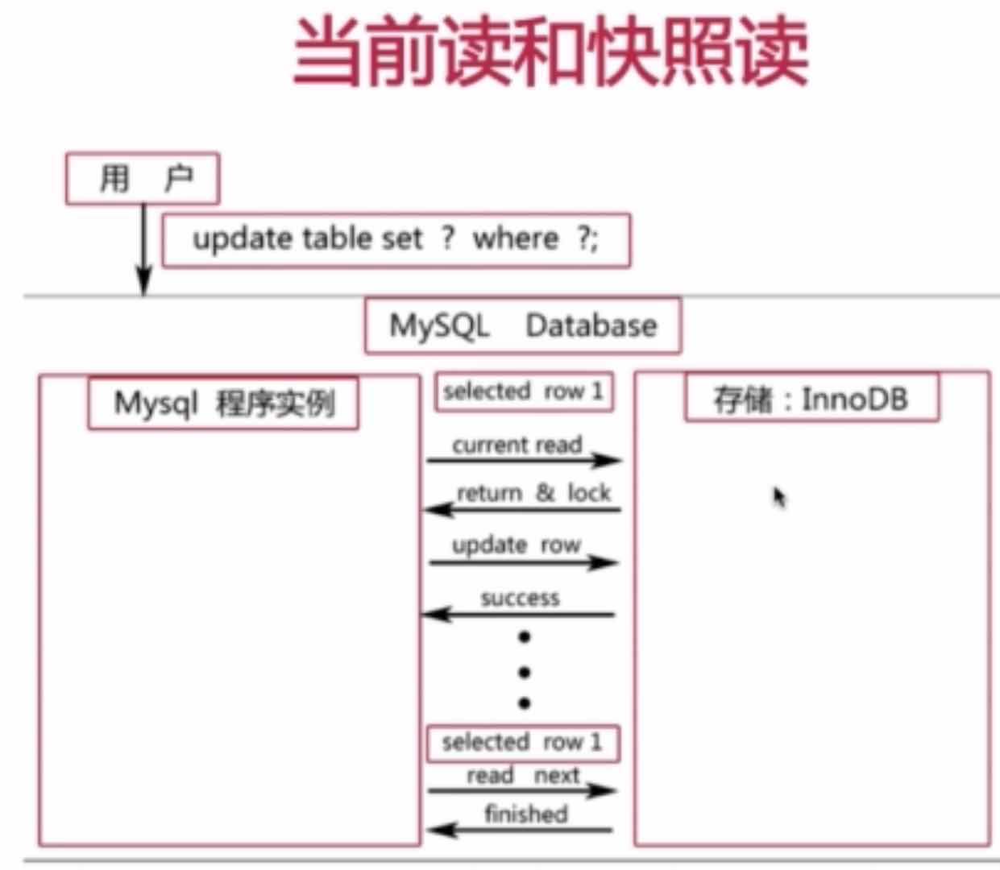
* 快照读：不加锁的非阻塞读， select
###### 这里的不加锁指的是在事务隔离级别不为serializable级别

    案例  ---  准备两个事务隔离级别为RC（read-committed）和两个RR（repeatable-read）的Session会话
    
    session1：
        # 查询一下当前的事务隔离级别
        select @@tx_isolation;
        # 设置当前的事务隔离级别为RC
        set session transaction isolation level read committed; 
        
        # 开启事务
        start transaction;
        commit;
        
        # 快照读
        select * from account_innodb where id = 2;
        # 当前读
        select * from account_innodb where id = 2 lock in share mode;
        commit;
        
    session2:
        # 查询一下当前的事务隔离级别
        select @@tx_isolation;
        # 设置当前的事务隔离级别为RC
        set session transaction isolation level read committed
        
        
        # 开启事务
        start transaction;
        commit;
        
        update account_innodb set balance = 600 where id = 2;
        commit;
###### 在RC（Read-Committed）隔离级别下,快照读和当前读的效果是一样的

    session3：
        # 查询一下当前的事务隔离级别
        select @@tx_isolation;
        # 设置当前的事务隔离级别为RR
        set session transaction isolation level repeatable read;
        
        # 开启事务
        start transaction;
        
        # 快照读
        select * from account_innodb where id = 2;
        # 当前读
        select * from account_innodb where id = 2 lock in share mode;
        commit;
        
    session4：
        # 查询一下当前的事务隔离级别
        select @@tx_isolation;
        # 设置当前的事务隔离级别为RR
        set session transaction isolation level repeatable read;
        
        # 开启事务
        start transaction;
        
        update account_innodb set balance = 300 where id = 2;
        commit;
        
###### 在RR（Repeatable-Read）隔离级别下，快照读有可能读到数据的历史版本，当前读只会得到数据的最新版本
    

#### （5）、RC、RR级别下的Innodb的非阻塞读（快照读-就是普通的select，什么都不加）如何实现
* 数据行里的DB_TRX_ID、DB_ROLL_PTR、RD_ROW_ID字段
###### DB_TRX_ID： 来标示最近一次对本行记录做修改，不管是insert还是update，对于delete来说，对于Innodb来说也是一次update，即最后一次修改本行记录的事务ID
###### DB_ROLL_PTR：回滚指针，指写入回滚段Roll-Back-Segment的undo日志记录，
###### RD_ROW_ID：行号，包含一个随着新行插入而单调递增的行ID，当由Innodb自动产生聚集索引时，聚集索引会包括行ID的值
* undo日志 
###### 当我们对记录做了变更操作是，就会产生undo记录，undo记录中存储的是老版记录，当一个旧的事务需要读取数据时，为了读取到老版本的记录，需要顺着undo列找到满足其可见性的记录
###### undolog分为俩种：insertundolog，updateundolog
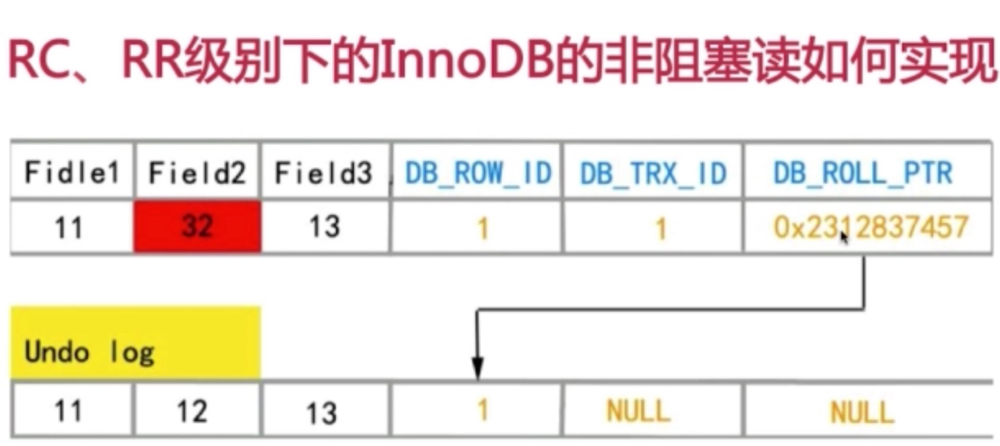
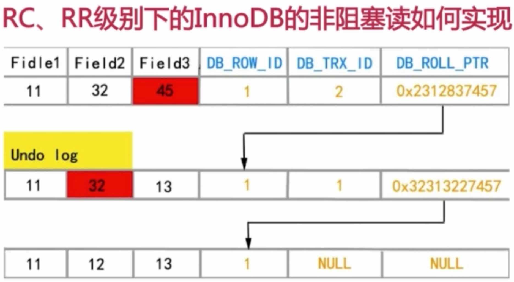

* read view 
###### 主要是用来做可见性判断的，即当我们去执行快照读（普通select）的时候，会针对我们查询的数据创建一个read view来决定当前事务能看到的是哪个版本数据，read view遵循一个可见性算法，目的是取出基于当前行数据的最稳定的版本。

##### next-key锁(行锁+gap锁)
* 行锁
* Gap锁：锁的目的是防止同一事务俩次当前读出现幻读的情况
###### 这就是为什么在RC（Read-Committed）下无法避免幻读的原因，在RR（Repeatable-Read）以上的级别默认都支持Gap锁

##### 在RR下对主键索引或者唯一索引会用Gap锁吗？
* 如果where条件全部命中，则不会用Gap锁，只会加记录锁

### 5、语法部分
#### （1）、关键语法
* Group By
* Having
* 统计相关：Count、Sum、Max、Min、Avg

##### GROUP BY 
###### 根据给定数据列每个成员对查询结果进行分组统计，最终得到一个分组汇总表
* 满足 "select子句中的列名必须为分组列或列函数"，通俗的将，就是如果用Group By， 那么Select语句中选出的列，要么是Group里用到的列，要么是带有聚合函数的列，
但是该条件只对同一张表有效
* 列函数对于Group By 子句定义的每个组各返回一个结果

##### HAVING 
* 通常与GROUP BY字句一起使用
* where 过滤行，having过滤组
* 出现在同一个SQL的顺序：where > group by > having 
